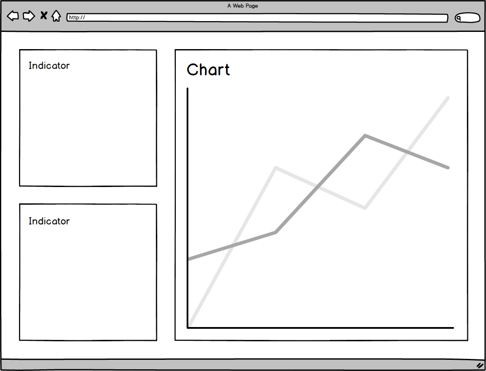

# Dear Lucy Coding Assignment

## Overview
This repository contains a simple React project for completing a short coding assignment. Read the detailed instructions below, implement the required functionality and create a pull request with your solution when you are satisfied with your work.

## Assignment
Visualize the data provided by the backend in [`server/routes/series.js`](server/routes/series.js). You can also modify the backend to suit your needs. Below is a list of ideas to get you started. You can implement one or several of these, or come up with your own ideas. Use [`client/ChartWidget/index.jsx`](client/ChartWidget/index.jsx) and [`client/IndicatorWidget/index.jsx`](client/IndicatorWidget/index.jsx) as starting points for your implementation.
* A chart showing the values per month
* An indicator showing the values for the current month
* An indicator showing the values compared to the previous month
* A toggle for showing values per month or cumulative values this year
* A toggle for showing values per country or the total value per month



### Coding
The starting point of your solutions should be one of the widgets in [`client`](client), but feel free to organize your code as you see fit. Focus on writing maintainable and easy to understand code over performance optimization. Lodash is already part of the project, but feel free to add new dependencies when needed.

### Testing
There is test skeleton in [`client/__tests__/ChartWidget.spec.jsx`](client/__tests__/ChartWidget.spec.jsx). Improve these tests to demonstrate the correctness of your solution. The tests can be run with the command ```npm test```.

## External Documentation
* http://lodash.com/docs
* https://facebook.github.io/jest/docs/api.html
* https://github.com/airbnb/enzyme/tree/master/docs/api
